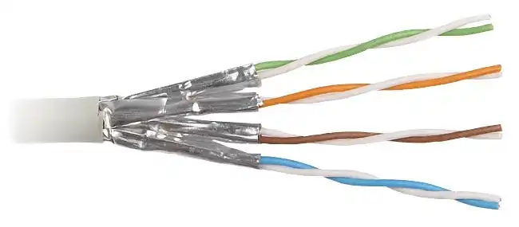

Ethernet Standard Copper

1. UTP (Unshielded Twisted Pair - Cặp dây xoắn không bọc chống nhiễu)

    

- Đây là cáp đôi - không có lớp chắn.
- Dễ lắp đặt, giá rẻ và phổ biến trong mạng LAN.
- Ví dụ: Cat5e, Cat6, Cat6a UTP.
- Ưu điểm: Linh hoạt, nhẹ và dễ uốn cong.
- Nhược điểm: Dễ bị nhiễu trong môi trường có nhiều thiết bị điện từ.

2. STP (Shielded Twisted Pair - Cặp dây xoắn bọc chống nhiễu)

    

- Nó có lớp chắn xung quanh mỗi cặp dây hoặc toàn bộ cáp.
- Nó giảm nhiễu điện từ (EMI) tốt hơn so với cáp UTP.
- Nó thường được sử dụng trong môi trường có nhiều thiết bị điện và máy móc công nghiệp.
- Ví dụ: Cat6a STP, Cat7 STP.
- Ưu điểm: ít nhiễu hơn, ổn định hơn trên khoảng cách xa.
- Nhược điểm: cứng, khó uốn cong, đắt hơn cáp UTP.

- 10 Base-T và 100 Base-T -> sử dụng 2 cặp (4 dây)
    + sử dụng các chân 1 2 3 6 (4 5 7 8 không sử dụng)
    + cáp thẳng (straight-through cable)
        * 1 2 -> gửi (TX)
        * 3 6 -> nhận (RX)
    + cáp chéo (crossover cable)
        * 1 2 -> nhận (RX)
        * 3 6 -> gửi (TX)
 
- 1000 Base-T và 10 GBase-T -> 4 cặp (8 dây)
    + cả 8 dây đều được sử dụng và có thể nhận & gửi đồng thời (cùng lúc)
    + 1000 Base-T: Full-duplex
    + 10 GBase-T: Full-duplex với mức mã hóa cao