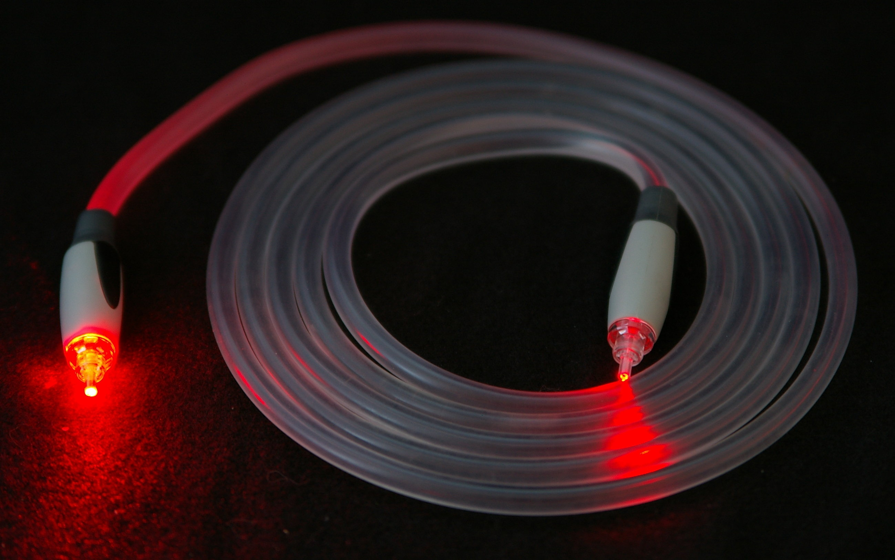
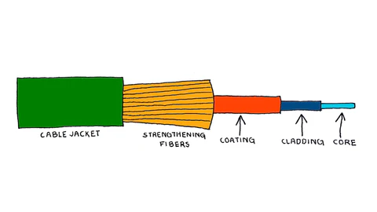
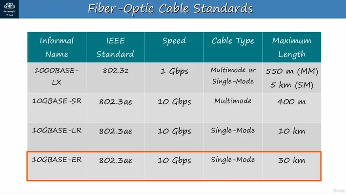

Signal transmission via fiberglass or plastic fiber using light pulses.

1. Glass fiber optic cable diagram (from inside out)

    Fiberglass -> transmits light pulses
    Light-reflecting sheath -> ensures light travels correctly and is not scattered
    Protective buffer layer -> protects the fiberglass from breaking
    Outer sheath of the cable

2. two type

- Multi - mod
    * Thicker fiberglass -> more light passes through at different angles -> faster signal attenuation
    * Maximum transmission distance: 300 - 500 meters
    * Cheaper -> due to the use of LED light diffusers

- singer - mod
    * Thinner fiberglass
    * Light is directed at a single angle from the laser emitter
    * Longer range than multi-mode or UTP cables
    * More expensive due to the use of a laser emitter

3. Standard fiber

    
