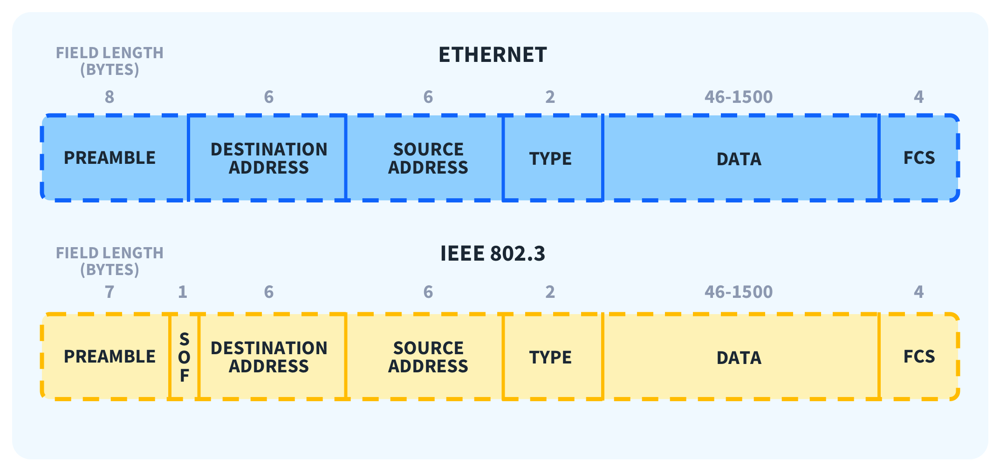

- Preamble (7 bytes) – Used to synchronize signals between the sender and receiver.
- Start Frame Delimiter (SFD, 1 byte) – Defines the start of the data frame.
- Destination MAC (6 bytes) – MAC address of the receiving device.
- Source MAC (6 bytes) – MAC address of the sending device.
- Type/Length (2 bytes) –
- For Ethernet II: this is the Type that identifies the protocol (e.g., 0x0800 = IPv4).
- For IEEE 802.3: this is the Length that indicates the length of the payload data.
- Payload/Data (46–1500 bytes) – Actual network data (can be IP, ARP, etc.).
- Frame Check Sequence (FCS, 4 bytes) – Uses CRC to check for data errors.
    * CRC (Cyclic Redundancy Check) detects errors by performing binary polynomial division. It uses a fixed generating polynomial G(x) to generate a check cipher, which helps detect errors.
    * Internally, divide the original data plus the remainder by the "number of polynomial bits".
        If it equals 0, the data is valid.
        If it is not 0, the data is corrupted.
    * CRC so hard understand -> summary
        Choose data A and a generator polynomial f(x).
        Calculate the CRC: B = A + CRC (remainder when A is divided by f(x))
        Send B over the network.
        The receiver recalculates:
            (B divided by f(x)) → remainder
            If remainder = 0 → data is correct
            If remainder ≠ 0 → data has an error

- Regarding Ethernet II vs IEEE 802.3 in the image:
- IEEE 802.3 has a Length field.
    * old -> length of payload 
- Ethernet II has a Type field.
    * define which protocol are use on layer 3 to process 
- The minimum payload is 46 bytes; padding will be added if the data is smaller.