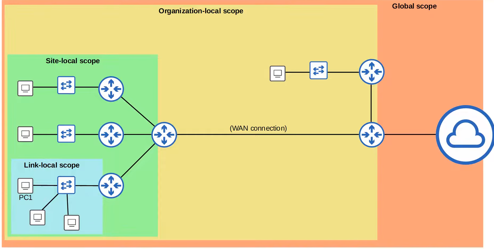

# 1. IPv6 Address Type

IPv6 có các loại địa chỉ chính:

- Global Unicast Address
- Unique Local Address
- Link Local Address
- Multicast Address
- Anycast Address

---

# 1.1 Global Unicast Address (GUA)

- Là địa chỉ IPv6 public.
- Có thể định tuyến trên Internet.
- Được cấp phát bởi ISP hoặc tổ chức quản lý địa chỉ.

Phạm vi:

```
2000::/3
```

Khoảng địa chỉ:

```
2000::
-
3FFF:FFFF:FFFF:FFFF:FFFF:FFFF:FFFF:FFFF
```

- Các địa chỉ IPv6 không thuộc phạm vi dành riêng khác có thể được sử dụng làm Global Unicast.

---

# 1.2 Unique Local Address (ULA)

- Là địa chỉ IPv6 dùng trong mạng nội bộ.
- Tương tự địa chỉ private của IPv4.
- Không được định tuyến trên Internet công cộng.
- Không cần đăng ký.

Phạm vi:

```
FC00::/7
```

Khoảng:

```
FC00::
-
FDFF:FFFF:FFFF:FFFF:FFFF:FFFF:FFFF:FFFF
```

---

## Cấu trúc ULA

Ví dụ:

```
FD43:93AC:8A8F:0001:0000:0000:0000:0001/64
```

Phân chia:

```
FD
```

- Prefix báo hiệu Unique Local Address.

```
43:93AC:8A8F
```

- 40 bit Global ID.
- Nên được tạo ngẫu nhiên để tránh trùng lặp.

```
0001
```

- 16 bit Subnet ID.

```
0000:0000:0000:0001
```

- Interface ID (64 bit).

Lưu ý:

- IPv6 thường dùng `/64`.
- Nhưng không phải mọi trường hợp IPv6 đều bắt buộc `/64`.

---

# 1.3 Link Local Address

- Là địa chỉ IPv6 tự động được tạo trên interface.
- Mặc định được kích hoạt trên interface IPv6.

Kích hoạt:

```
R1(config-if)# ipv6 enable
```

Lệnh này:

- Bật IPv6 trên interface.
- Không cần cấu hình Global IPv6 address.
- Router tự tạo Link Local Address.

---

## Phạm vi Link Local

```
FE80::/10
```

Khoảng:

```
FE80::
-
FEBF:FFFF:FFFF:FFFF:FFFF:FFFF:FFFF:FFFF
```

Cấu trúc:

```
1111111010 + 54 bit zero + Interface ID
```

Trong thực tế:

- Link Local thường bắt đầu bằng:

```
FE80
```

---

## Đặc điểm Link Local

- Chỉ giao tiếp trong cùng một local link.
- Router không định tuyến Link Local giữa các mạng khác nhau.

Ứng dụng:

- OSPFv3
- Next-hop trong IPv6 static route
- Neighbor Discovery Protocol (NDP)

NDP thay thế chức năng ARP trong IPv6.

---

# 1.4 Multicast Address

- Multicast là mô hình:

```
One-to-Many
```

- IPv6 sử dụng multicast thay cho broadcast.

Phạm vi:

```
FF00::/8
```

Khoảng:

```
FF00::
-
FFFF:FFFF:FFFF:FFFF:FFFF:FFFF:FFFF:FFFF
```

IPv6:

- Không sử dụng Broadcast.
- Không có địa chỉ Broadcast IPv6.

---

# Các nhóm Multicast thường gặp

| Nhóm | IPv6 | IPv4 tương đương |
|-|-|-|
| All Nodes | FF02::1 | 224.0.0.1 |
| All Routers | FF02::2 | 224.0.0.2 |
| All OSPF Routers | FF02::5 | 224.0.0.5 |
| All OSPF DR/BDR | FF02::6 | 224.0.0.6 |
| All RIP Routers | FF02::9 | 224.0.0.9 |
| All EIGRP Routers | FF02::A | 224.0.0.10 |

---

# Multicast Address Scope

IPv6 sử dụng Scope để xác định phạm vi multicast.

Lưu ý:

```
FF02 Link-local scope
```

khác với:

```
IPv6 Link-local address FE80::/10
```

---

## Các Scope phổ biến

### Interface-local

```
FF01
```

- Gói tin không rời khỏi thiết bị.
- Dùng cho dịch vụ chạy cục bộ.

---

### Link-local

```
FF02
```

- Chỉ trong cùng một mạng LAN.
- Router không forward.

---

### Site-local

```
FF05
```

- Có thể được router chuyển tiếp.
- Giới hạn trong một site.

---

### Organization-local

```
FF08
```

- Phạm vi lớn hơn site-local.
- Trong phạm vi tổ chức.

---

### Global

```
FF0E
```

- Có thể định tuyến trên Internet.

---

Kiểm tra multicast interface:

```
R1(config)# show ipv6 interface g0/0
```

Ví dụ:

```
Joined group address(es):

FF02::1
FF02::2
FF02::1:FF36:8500
```

Ý nghĩa:

```
FF02::1
```

- All Nodes.

```
FF02::2
```

- All Routers.

---

# 1.5 Anycast Address

- Anycast là mô hình:

```
One-to-One-of-Many
```

So sánh:

- Unicast:
    - Một địa chỉ → một thiết bị.

- Multicast:
    - Một địa chỉ → một nhóm thiết bị.

- Anycast:
    - Một địa chỉ → thiết bị gần nhất trong nhóm.

---

## Cách hoạt động

- Nhiều router được cấu hình cùng một IPv6 address.
- Các router quảng bá địa chỉ đó bằng giao thức định tuyến.
- Host gửi packet đến địa chỉ Anycast.
- Router sẽ chọn đường đi gần nhất.

---

## Cấu hình Anycast

Ví dụ:

```
R1(config)# interface g0/0
R1(config-if)# ipv6 address 2001:db8:1:1::99/128 anycast
```

Nếu router bật routing:

- Địa chỉ Anycast có thể được quảng bá.
- Packet sẽ đi đến router gần nhất.

Lưu ý:

- Anycast không có prefix riêng.
- Không tự động quảng bá nếu không bật routing hoặc cấu hình routing protocol.

---

# 1.6 Other IPv6 Address

## Unspecified Address

```
::
```

- Tất cả bit bằng 0.
- Tương đương:

```
0.0.0.0
```

trong IPv4.

Sử dụng khi thiết bị chưa có địa chỉ IPv6.

---

## Loopback Address

```
::1
```

- Dùng để kiểm tra IPv6 protocol stack trên thiết bị.

Tương đương:

```
127.0.0.1
```

trong IPv4.

Đặc điểm:

- Packet gửi đến `::1` được xử lý ngay trên thiết bị.
- Không rời khỏi máy.


