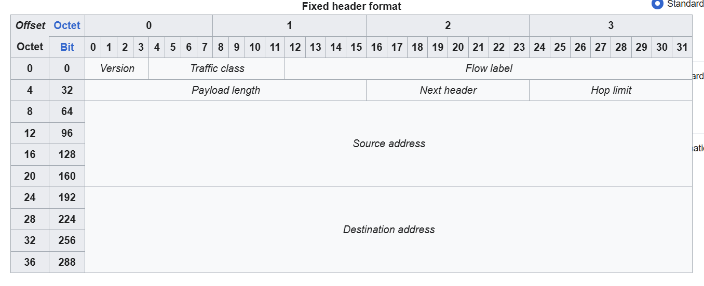

# IPv6 Header
- 
- IPv4 header có độ dài thay đổi từ 20 - 60 bytes
- IPv6 header cố định 40 bytes

# 1. Version field
- 4 bits
- Cho biết phiên bản IP đang sử dụng
- Giá trị cố định: 6 (dạng nhị phân: 0b0110)

# 2. Traffic class
- 8 bits
- Được sử dụng cho QoS để chỉ ra lưu lượng truy cập có mức độ ưu tiên cao hơn
- Ví dụ: IP phone traffic, live video, ...

# 3. Flow label
- 20 bits
- Sử dụng để xác định các luồng lưu lượng cụ thể giữa Source và Destination

# 4. Payload length
- 16 bits
- Cho biết độ dài toàn bộ phần dữ liệu đi kèm tính bằng Byte (bao gồm Extension Headers nếu có + Lớp 4 Segment)
- Không bao gồm 40 bytes của IPv6 header cơ bản

# 5. Next Header
- 8 bits
- Cho biết loại tiêu đề kế tiếp được đóng gói (có thể là Extension Header hoặc giao thức Lớp 4 như TCP/UDP/ICMPv6)

# 6. Hop limit
- 8 bits
- Giá trị sẽ giảm đi 1 đơn vị khi đi qua mỗi router chuyển tiếp
- Khi giá trị về 0 thì gói tin sẽ bị drop để tránh vòng lặp mạng

# 7. Source / Destination Address
- 128 bits mỗi field (tổng cả 2 là 256 bits / 32 bytes)
- Chứa địa chỉ IPv6 nguồn và đích