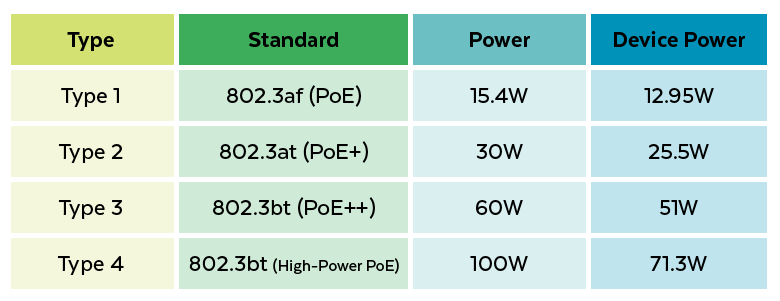
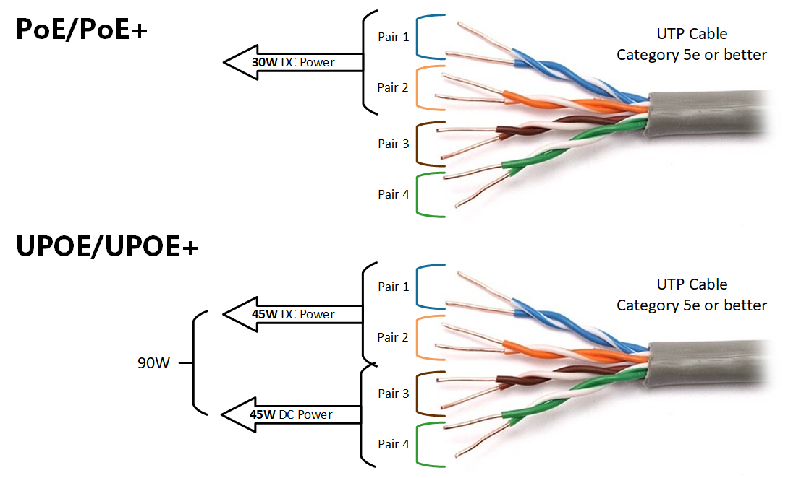

Power over Ethernet (PoE) 
1 LAN cable = both data transmission and power supply
No separate adapter needed for the device

- Which devices are they for:
    * Access Point (AP)
    * IP Camera
    * IP Phone
    * IoT devices
- -> In general: network devices located far from power outlets

- How it works
    * There are two main components:
        + PSE (Power Sourcing Equipment)
            → Switch or injector that supplies power
        + PD (Powered Device)
        → Device that receives power (AP, camera, etc.)

- Simple procedure:
    * The switch checks if the device supports PoE.
    * If yes → supply power.
    * If no → do not supply power (to avoid fire).

- This “identification” uses:
    * Cisco Discovery Protocol (Cisco)
    * Link Layer Discovery Protocol (common standard)

- Standard PoE

- Inside PoE, PoE+, UPoE, UPoE+

