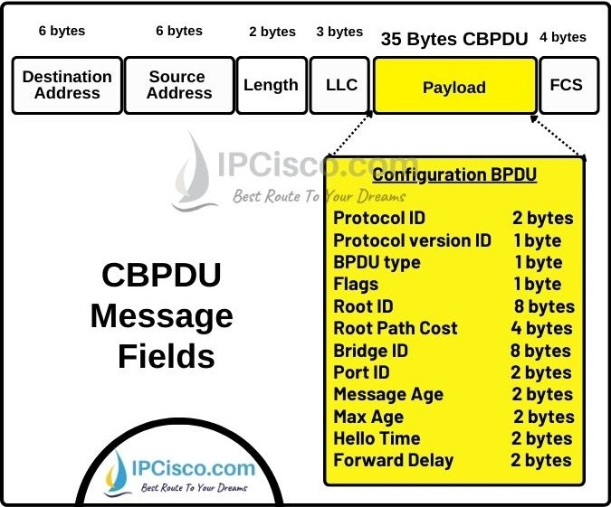

- Switch cisco gửi BPDU đến multicast: **01:00:0C:CC:CC:CD**
- Switch hãng khác gửi BPDU đến multicast (chuản IEEE): **01:80:C2:00:00:00**
- đối với switch cisco gửi BPDU đến cả 2 multicast, switch hãng khác chỉ gửi 1 multicast
- Cấu trúc Ethernet Frame chứa BPDU 802.1D

- 

- DMAC: nơi đến -> là MAC multicast bpdu
- SMAC: MAC interface gửi BPDU
- Length: độ dài payload
- LLC: định danh BPDU / STP
- Payload:
    * Protocol ID: định danh STP (luôn = 0)
    * Version: phiên bản STP (0=STP, 2=RSTP)
    * BPDU Type: loại BPDU (Config / TCN)
    * Flags: báo thay đổi topology (TC, TCA)
    
    * Root ID: ID của Root Bridge (quan trọng nhất)
    * Root Path Cost: chi phí từ switch đến root
    * Bridge ID: ID của switch gửi BPDU
    * Port ID: cổng gửi BPDU

    * Message Age: tuổi của BPDU
    * Max Age: thời gian BPDU còn hiệu lực
    * Hello Time: chu kỳ gửi BPDU
    * Forward Delay: thời gian chuyển state
