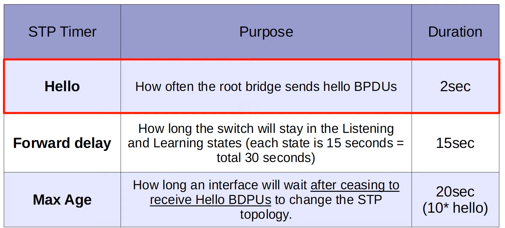

# 1. STP states
- là trạng thái của port đang ở states nào
## 1.1. Blocking 
- chặn loop
- không gửi/nhận gói tin, nếu nhận -> drop
- vẫn nhận BPDU STP -> để biếu cấu trúc
- nhưng không chuyển tiếp BPDU
- có thể sang Forwarding
- không học MAC
- nếu port là Non-Designed -> sẽ ở states này không lên listening
## 1.2. Listening 

- Bắt đầu tham gia tính toán STP
- Gửi và nhận BPDU
- Chưa forward data
- Chưa học MAC
- Dùng để tránh loop trước khi mở port
- Thời gian: ~15 giây (Forward Delay)

## 1.3. learning
 
- Bắt đầu học MAC address (fill MAC table)
- Vẫn chưa forward data
- Vẫn gửi/nhận BPDU
- Chuẩn bị chuyển sang Forwarding
- Thời gian: ~15 giây

- ## 1.4. Forwarding 
- Bắt đầu học MAC address (fill MAC table)
- Vẫn chưa forward data
- Vẫn gửi/nhận BPDU
- Chuẩn bị chuyển sang Forwarding
- Thời gian: ~15 giây

- ## 1.5 Disable 
- Port bị tắt (shutdown) hoặc lỗi
- Không tham gia STP
- Không gửi/nhận gì cả

# 2. STP timers
- hello: Root Bridge gửi gói "hello" mỗi 2 giây
- forward delay: từ port blocking đến forwarding phải qua 2 states - mỗi states / 15 giây
- maxage: nếu switch không nhận được hello bpdus trong khoảng thời gian đó -> nó sẽ bắt đầu tính lại STP

# 3. tổng kết
- từ trạng thái forwarding chuyển sang blocking -> 0 giây
- blocking chuyển sang forwarding -> 15 + 15 = 30 giây
- không nhận bpdu: 20 giây
