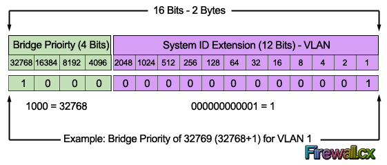
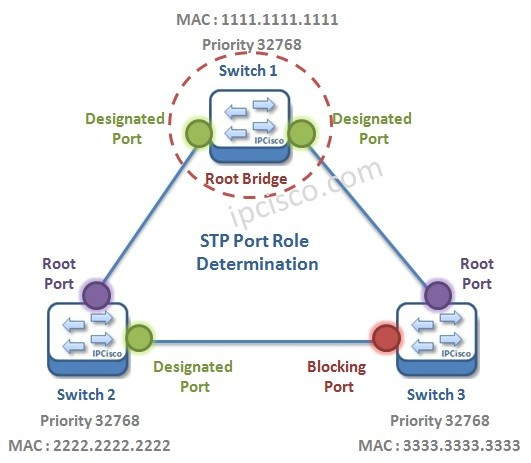
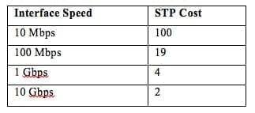
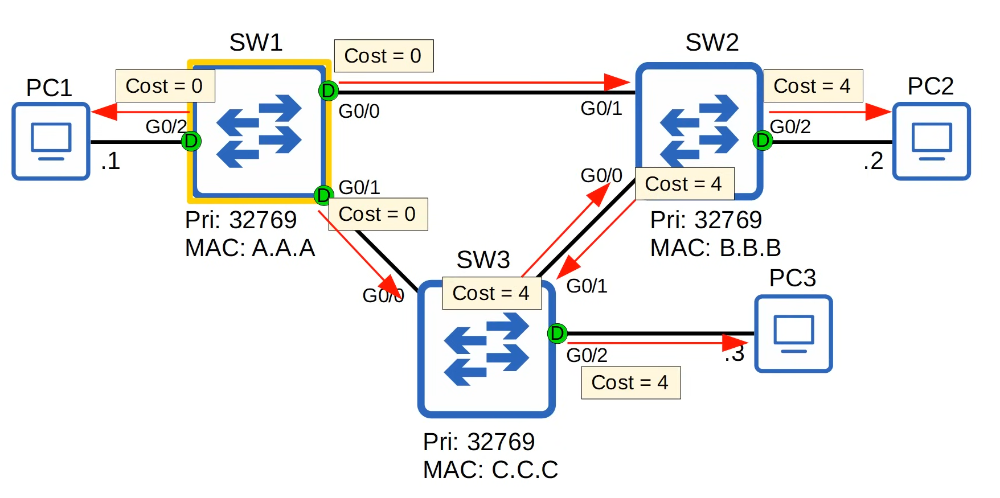
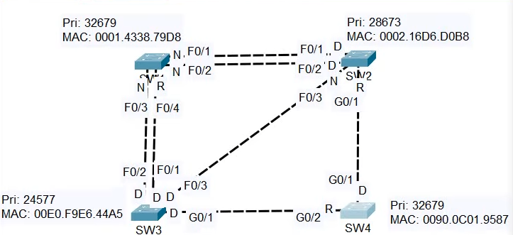

# 1. STP - spanning tree protocol
- Mô hình mạng không có STP -> sẽ xảy ra các loop switch -> do các gói tin đi qua giữa các switch nên TTL không giảm -> nên các gói tin chạy vòng vô hạn
- **classic spanning tree protocol IEEE 802.1D**
- mặc định các switch đều bật STP
- khi switch hoạt động: nó sẽ gửi các BPDU cho nhau gồm các thông số giúp các switch bầu chọn và tính toán cấu trúc spanning tree
- swtich gửi **Hello BPDUs** ra khỏi interfaec mỗi 2 giây
- switch khác nhận BPDUs -> biết interface đang kết nối với switch khác
    * router, pc,.. không dùng STP -> nên không gửi BPDUs
- để không xảy ra loop ta chỉ nên chọn các cổng mở / đóng để không bị loop và đảm bảo các switch vẫn nối nhau - tức liên thông nhau
- Ta cần biến mạng switch thành *cây* bằng cách chọn 1 switch làm Root bridge để làm điểm gốc để mọi switch khác tính đường đi 
- switch dùng 1 field trong STP BPDU là **Bridge ID Field** để bầu chọn Root Bridge

- 

# 2. Bridge id field
- Bridge id field (8 bytes - 64 bits)
- cách các switch chọn Root Bridge:
    * So sánh bridge priority trước -> chọn switch có bridge priority nhỏ nhất
    * nếu cả 2 switch cùng bridge priority -> so sánh 2 switch ai có MAC nhỏ nhất (mac là độc nhất nên phải khác) 

## 2.1. Bridge priority
- có 2 bytes
- Bridge priority gồm 2 field: priority và vlan-id
- Bridge priority: 4 bits cuối
    * mặc định các switch có bridge priority là 32768 (lớn nhất)
    * có thể chỉnh bridge priority để ép switch thành Root Switch hoặc Designed Switch
    * phải chỉnh bridge priority theo bội số 4096 do nó là 4 bit cuối của 16 bit
- Vlan id: 12 bits
- cisco dùng **PVST (per-vlan spanning tree)**
    * phiên bản khác của STP
    * chạy trên từng vlan -> mỗi vlan sẽ có STP riêng
    * các cổng đóng/mở theo từng vlan
- 12 bits -> có 4095 vlan
- default vlan 1: 32768 + 1 = 32769
- bridge priority + extension system ID = bridge field
- extension system ID không thể thay đổi -> bởi vì nó gắn từng vlan -> thay đổi bridge priority
- khi 1 switch Root Bridge hoạt động -> nó sẽ nhường lại Root Bridge nếu nó nhận "superior BPDU lowest bridge ID"
- khi mô hình đã xong chỉ có root switch gửi BPDU
- các switch khác chỉ chuyển tiếp các gói tin BPDU từ Root Bridge

# 2.2. MAC
- nếu các switch cùng Bridge priority -> ta sẽ chọn switch nào có MAC nhỏ nhất
- MAC nhỏ nhất là MAC có số **thập lục phân** nhỏ nhất mà xét từ qua phải
- lưu ý: thường các switch đời cũ sẽ có MAC cao hơn 
- tốt nhất ta cấu hình các switch khác có bridge priority cao và switch muốn là Root Bridge thì ta cấu hình bridge priorty thấp nhất
# 3. Root & Designed & Blocking Port
- khi đã xác định được Root Bridge -> các cổng mà switch Root Bridge nối đều được mở để chuyển tiếp BPDU đến các switch khác
- tức các port của Root Bridge là **Designed Port**
- để các switch khác không phải Root Bridge chuyển gói không bị Loop thì phải xác định các port nào được đóng hay mở
- các port đó là:
    * Root port: là port tốt nhất (cost nhỏ nhất) để đi về Root Bridge
    * Designted port: là port được chọn để forward traffic trên mỗi segment
    * Blocking port: là port bị chặn để tránh loop

- mỗi switch sẽ có ít nhất 1 port là Root Port
- ý tưởng STP là cây khung
    * ta xem mạng switch là đồ thị, mỗi switch là đỉnh còn các link nối 2 switch là cạnh
    * tạo ra cây khung tức n đỉnh ta chỉ chọn n - 1 cạnh -> các cạnh còn lại sẽ blocking -> tránh loop
    * lưu ý là các cạnh được chọn là cả 2 port cảu cạnh đó đều được traffic - có thể 1 cạnh 1 port được mở và port kia thì đóng
- cách xét chọn root port (xét từ trên xuống)
    * Lowest root cost
    * Lowest neightbor bridge ID
    * Lowest neightbor port ID
## 3.1. Lowest root cost
- cost ở đây là tốc độ giao diện giữa 2 switch
- mỗi tốc độ giao diện đều có STP cost riêng -> tốc độ càng cao -> STP cost càng thấp
- Root cost = tổng cost từ switch hiện tại -> Root Bridge
- port của Root Bridge đêu có cost là 0 - do nó là Root

- Mỗi switch (ngoài trừ Root Bridge) đều có 1 root port
- port nào mà có tổng từ switch đó đến Root Bridge nhỏ nhất sẽ được chọn làm Root Port

- switch 1 là root bridge
- nếu switch 3 đi qua switch 2 rồi đến switch 1 thì -> tổng cost = 4 + 4 = 8 <=> g0/1 sw 3 -> g0/0 sw2 và từ g0/1 sw2 -> g0/0 sw1
- nếu switch 3 đi qua switch thì -> tổng cost = 4 -> port G0/0 của switch 3 là Root Port
- tương tự witch 2 đi qua sw1 là Root Port tức G0/1
- còn lại link giữa switch 2 - 3 sẽ có 1 port là Designed Port và Blocking Port
- nếu các switch có cùng root cost thì ta sẽ xét đến: Lowest Neighbor bridge ID

## 3.2. Lowest neighbor Bridge ID
- lowest neighbor bridge id tức ai nối hàng xóm có bridge id thấp hơn thì chọn
- nếu các switch cùng lowest neighbor bridge id thì tiếp tục xét lowest port id

## 3.3. Lowest neighbor Port ID
- Switch sẽ chọn port neighbor switch có Port ID nhỏ hơn (Port ID = port priority + số port).
- port ID có 16 bits
- port priority (8 bits):
    * mặc định là 128
    * có thể chỉnh để ưu tiên port
- số port - port number (8 bits): số port
- ví dụ: 
    * g0/0 = 128.0 + 0.1 = 128.1
    * g0/1 = 128.1
    * g0/2 = 128.3
- có thể xem bằng lệnh: show spanning tree

## 3.4 tổng kết
- khi đã xác định Root Bridge dựa vào Bridge id field gồm Bridge priority và extension vlan id
- các port của Root Bridge đều là Designed port -> tức đều được forward traffic
- mỗi switch (ngoài trừ Root Bridge) đều được có 1 Root port -> ta xác định port đó của mỗi switch dựa vào
    * Lowest root cost
    * Lowest neightbor bridge ID
    * Lowest neightbor port ID
- nhớ rằng chỉ có n - 1 cạnh là mở tức số link = số swich - 1 được mở
- ta xác định các port còn lại cũng dựa vào:
    * Lowest root cost
    * Lowest neightbor bridge ID
    * Lowest neightbor port ID

- ví dụ:

