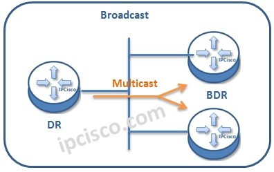
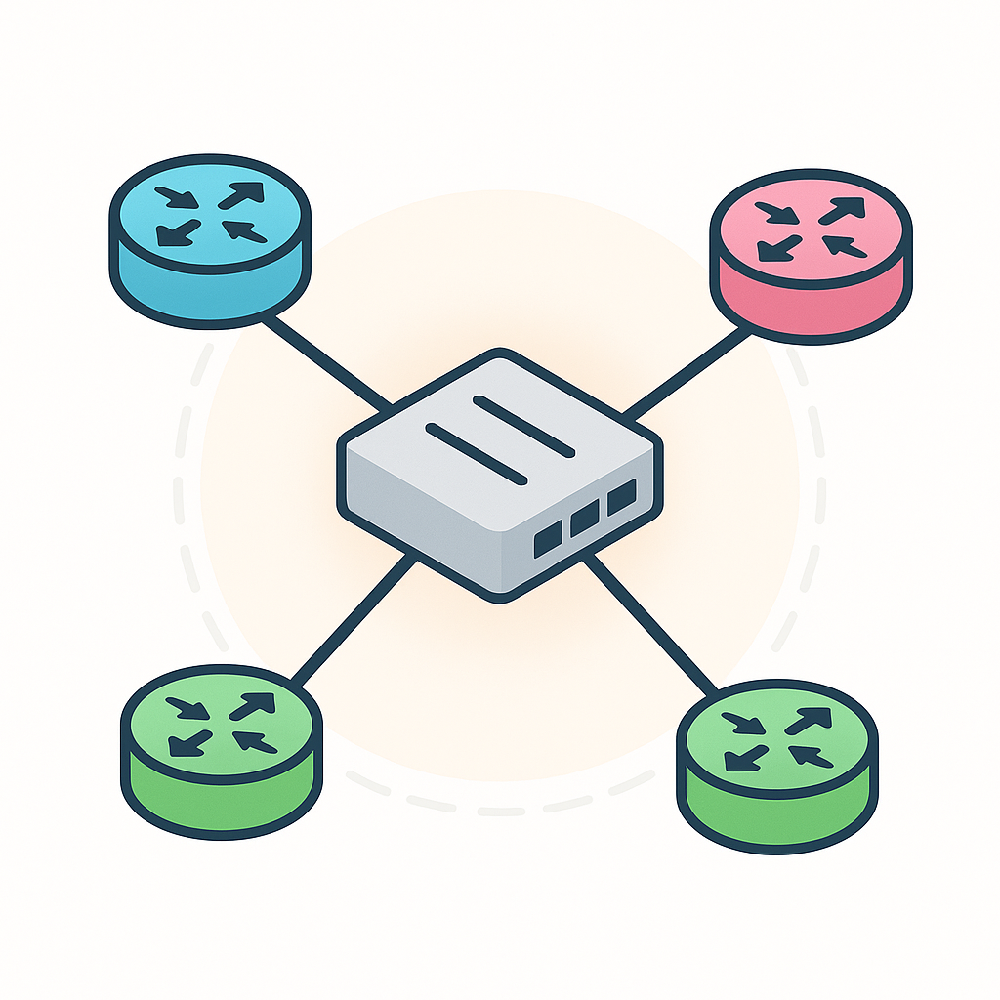
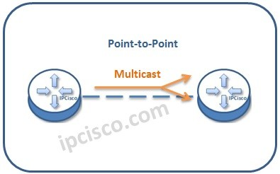

# 1. OSPF
- OSPF - Open shortest path first
- sử dụng thuật toán *Dijkstra's algorithm*
- dùng Link-State để tạo map kết nối
- Các Router chia sẽ các information về interface của các router liền kề đến các router khác -> cho đến khi các router cùng bản đồ mạng
- LSA (Link-State Advertisement) là gói tin để quảng bá trạng thái liên kết
    * sử dụng nhiều tài nguyên cpu
    * phản ứng nhanh khi cấu trúc mạng thay đổi
- LSDB (Link-State Databse): Là cơ sở dữ liệu chứa toàn bộ thông tin topology mạng
    * Được tạo từ các LSA
    * Mỗi router trong cùng area sẽ có LSDB giống nhau
- Router sẽ flood LSA cho đến khi các router cùng *map*
- khi có mạng mới -> Router sẽ tạo LSA -> báo cáo các router khác -> các router khác sẽ tính best route đến mạng đó
- môi 30 phút -> gửi lại LSA -> tránh LSA cũ
    * khi có thay đổi -> lập tức tạo LSA mới 
    * lưu ý LSA mới khác với LSA gửi đi sau mỗi 30 phút

# 2. Version
- OSPFv1: 1989
- OSPFv2: 1998 -> IPv4
- OSPFv3: 2008 -> IPv6

# 3. Area
- dùng để chia mạng
- thường mạng nhỏ dùng 1 khu vực (đơn)
- mạng lớn -> phải dùng nhiều khu vực -> giúp giảm LSA
    * không tốn tính LSA
    * SPF (Shortest Path First) phản ứng nhanh
    * giảm LSDB
    * mạng nhỏ thay đổi -> không ảnh hướng LSA toàn bộ mạng
- các rotuer cùng Area sẽ shared chung LSDB
- Area 0 (Backbone Area): toàn bộ các area 0 khác kết nối tới Area 0
    * hoặc phải virtual link tới (hiếm)
- ABR (Area border router): router nằm giữa 2 area
    * ví dụ: area 0 - G0/1 Router1 G0/0 - area 1
    * Giữ LSDB riêng từng area
    * Chuyển LSA giữa các area (tóm tắt/summary)
    * thường không nên kết nối quá nhiều area -> 2 hoặc 3 area là hợp lý
- Internal router: nằm trong 1 area
- ABR: nằm giữa các area
- ASBR: kết nối OSPF với mạng khác (BGP, static,...)
    * OSPF - G0/1 router1 G0/0 - BGP
- Intra-area: là gói tin đi trong cùng 1 area
- Inter-area: là gói tin đi giữa các area (qua ABR)

- tóm tắt các loại router area trong OSPF:
    * ABR: là rotuer nối 2 area trở lên
    * ASBR: là rotuer nối với mạng khác (BGP,...)
    * internal router: là router hoàn toàn nằm trong cùng 1 area

# 3.Router-ID
- rotuer-id là Một định danh duy nhất (unique) để nhận diện router trong OSPF.
- OSPF dùng Router-ID để:
    * nhận diện từng router trong LSDB
    * Xây dựng adjacency (neighbor)
    * Chạy SPF và phân biệt nguồn LSA
    * Đánh dấu “ai tạo ra thông tin này”
- độ ưu tiên router khi chọn Router-id
    * tự cấu hình
        * R1(config)# router ospf 1
            * R1(config-router)# router-id 1.1.1.1
    * ip cao nhất của loopback
        * R1(config)# 
    * ip cao nhất của giao diện của router đó
- khi khai báo router-id, sau đó phải *clear ip ospf process*
    * để restart hệ thống cập nhật rotuer-id mới
- khai báo router-id trước khi khai báo network

# 4. Metric
- metric của ospf là cost của tốc độ giao diện dựa trên
- cost = Refernce bandwith / interface bandwith
- Refernce bandwith mặc định là 100 Mbps
- interface bandwith là tốc độ giao diện
- lưu ý cost luôn nhận giá trị là số nguyên dương tức -> cost >= 1
- nếu tốc độ interface là 1000 Mbps thì cost = 100 / 1000 = 1 (không nhận số thập phân)
- có thể chỉnh Referce từ 1 - 4294967 (tức 23 bit)
- nên cấu hình Refernce bandwith lớn hơn tốc độ cao nhất của mọi giao diện trong mô hình mạng -> để các router tính SPF được tối ưu hơn
- interface loopback có cost là 1 (ảo)
- nếu R1 G0/1 - G0/1 R2
    * khi R1 gửi gói tin đến loopback R2 thì sẽ cost = G0/1 của R1 + loopback R2 = 100 + 1 = 101
- nếu R1 - R2 - R3 
    * toàn bộ giao diện là Gigabitethernet
    * cost = 100 + 100 = 200
- có thể chính *Cost* để ép rotuer đi đường khác
    * chỉnh cost từ 1 - 65536 (16 bit)

* lưu ý:
    * chỉnh tốc độ giao diện vẫn không thay đổi dữ liệu tính của **interface bandwith**
    * tức ta hạ tốc độ giao diện từ 100 Mbps xuống 10 Mbps nhưng tính cost thì interface bandwith vẫn sử dụng 100
    * Không nên hạ tốc độ giao diện vì nó làm chậm tốc độ mạng -> không khuyên dùng
    * ta chỉ nên chỉnh *reference bandwith* và *ip ospf cost* để ép router đi đường ta muốn

# 5. OSPF Neighbor
- khi các rotuer kết nối nhau -> thì các router đó bắt tay sẽ thành OSPF neighbor
- khi router trở thành *neighbor* -> tự động shared information, calculating,...
- khi OSPF được kích hoạt trên giao diện -> gởi gói tin *hello message* ra khỏi giao diện theo định kỳ
    * default time hello: 10s
    * gửi multiset: 224.0.0.5 cho toàn bộ OSPF router
    * OSPF message được đóng gói trong IP Header và có giá trị 89
    * khi các router nhận packet *hello* -> sẽ thêm router đó vào OSPF table
    * và cùng router đó vào các *trạng thái*

- có 7 trạng thái OSPF neighbor

## 5.1. Down State
- cả 2 router chưa biết nhau
- router A bất đầu flood packet Hello Message tới multiset 224.0.0.5

## 5.2. Init State
- router B nhận packet của router A, và thêm router A vào OSPF table

## 5.3. 2-way State
- router B gửi lại packet bao gồm RID owner và Neighbor RID (tức RID router A)
- router A nhận packet với RID neighbor chính nó
- cả 2 router A và B trở thành OSPF neighbor -> bất đầu shared LSA và tạo LSDB
- bất đầu chọn DR (Designated Router) và BDR (backup Designated Router)

## 5.4. Exstart State 
- 2 router bất đầu chuẩn bị để shared LSDB của chính họ
- nhưng phải chọn router nào bất đầu gửi
- router sẽ chọn RID nào cao sẽ trở thành *Master*
- router có RID thấp sẽ trở thành *Slave*
- để quyết định Master và Slave thì các router phải trao đổi gói tin DBD (databse description) cho nhau -> để biết router nào có RID cao hay thấp

## 5.5. Exchange State
- các Router sẽ trao đổi DBD chứa danh sách LSA trong LSDB của rotuer đó
- DBD này chỉ chứa các thông tin cơ bản không chứa thông tin chi tiết của LSA
- router sẽ so sánh DBD mà nó nhận với LSDB chính nó để xác định xem LSA nào nên được nhận từ router neighbor nào đó

## 5.6. Loading State
- Router gửi LSR (Link State Request) để yêu cầu router neighbor đó gửi bất kỳ LSA nào mà họ chưa có -> để đảm bảo 2 router cùng LSDB
- LSA sẽ được gửi dưới dạng là gói tin LSU (link state update)
- router sẽ gửi lại LSAck (link state acknowledge) để báo rằng đã nhận LSA

## 5.7 Full State
- router đã nhận Full OSPF -> đảm bảo LSDB giống nhau
- tuy nhiên các router vẫn tiếp tục gửi và lắng nghe các *hello packet* (mỗi 10s) -> để duy trì hàng xóm
- mỗi khi nhận gói *hello* -> reset *dead time* về 40s (default)
- nếu *dead time* về 0s -> router đó sẽ loại hàng xóm đó
- khi đó router sẽ báo toàn bộ mạng là đã có sự thay đổi cấu trúc

## 5.8. Tóm tắt
- LSA - Link State Advertisement: Là gói tin mô tả trạng thái link
- LSDB - Link-State Database: Là bản đồ mạng hoàn chỉnh của router
- LSU - Link-State Update: Là gói mang LSA đi gửi cho router khác
- LSR - Link-State Request: Khi router thiếu thông tin trong LSDB
- LSAck - Link-State Acknowledgment: Gói xác nhận đã nhận LSA
- DBD - Database Description: Là gói mô tả “tóm tắt LSDB”, Không gửi toàn bộ dữ liệu chi tiết

# 6. *5* Packet types
- *hello message*: xác định router neighbor
- *DSB*: tóm tắt LSDB của router -> kiểm tra LSDB
- *LSR* yêu cầu router neighbor gửi LSA -> khi router thấy thiếu thông tin hoặc cần bảng chu tiết
- *LSU*: gửi các LSA cụ thể cho router liền kề
- *LSAck*: xác nhận router đã nhận được gói tin (đặc biệt LSU)

- đó là toàn bộ quy trình đồng bộ LDSB

# 7. OSPF type LSA
- LSA có nhiều loại để chứa một số thông tin nào đó
- gồm có 11 types

## 7.1 LSA type 1
- do mọi router tạo
- gửi trong cùng 1 area
- mô tả: interface và link cost

## 7.2. LSA type 2
- do DR (Designed router) tạo
- mô tả mạng multi-access (Ethernet)
- liệt kê các router trong segment
- chỉ tồn tại trong cùng area

## 7.3. LSA type 3
- do ABR (Area border router) tạo
- tóm tắt route từ area này sang area khác
- không mang theo đầy đủ toplogy
- giúp liên kết các area

## 7.4. LSA type 4
- do ABR tạo
- chỉ đường tới ASBR (router redistributing route từ ngoài vào OSPF) - đường đi tới router biên

## 7.5. LSA type 5
- Do ASBR tạo
- Mang route từ bên ngoài OSPF (EIGRP, static, RIP...)
- Flood toàn AS (trừ stub area)

## 7.6. LSA Type 6 – Multicast LSA
- Dùng cho MOSPF (Multicast OSPF)
- Hiện nay gần như không dùng

## 7.7. LSA Type 7 – NSSA External LSA
- Dùng trong NSSA area
- Do ASBR trong NSSA tạo
- Sau đó ABR convert thành Type 5

## 7.8. LSA Type 8 – External Attributes LSA
- Ít dùng, liên quan routing policy (OSPFv2 mở rộng)

## 7.9. LSA Type 9, 10, 11 – Opaque LSA
- Dùng cho extension (MPLS, traffic engineering...)
- Không ảnh hưởng routing cơ bản

## 8. OSPF on interface
- có thể cấu hình ospf trực tiếp trên interface
- interface g0/2
    * ip ospf 1 area 0
- nên khai báo không đẩy các gói tin ospf ra khỏi interface kết nối không phải layer 3
    * ip ospf 1
        * passive-interface default // chặn gửi tất cả interface không gửi gói hello ospf
        * no passive-interface g0/0 // chỉ interfaec g0/0 được gửi gói tin hello ospf

## 9. Loopback interface
- Interface ảo (virtual interface) trên router
- Không phụ thuộc phần cứng
- Luôn ở trạng thái UP (trừ khi tắt thủ công) và có ip (tự cấu hình)
- nếu đặt router id là ip interface vật lý, nếu interface đó bị lỗi thì ospf sẽ bị thay đổi không mong muốn
- đặt rotuer id là loopback interface sẽ giải quyết vấn đề là không bị lỗi vì nó là giao diện ảo - trừ khi administrator chủ động shutdown loopback

# 9. OSPF Netowk types
- kiểu mạng kết nối ospf liền kề
- có 3 kiểu

## 9.1. Broadcast 
- gồm: Ethernet (LAN phổ biến) và FDDI (cũ)
- cho phép broadcast và multicast
- có thể có router trên cùng segment
- OSPF sẽ bầu DR/BDR

## 9.2. non-broadcast
- gồm: Frame Replay, ATM, X.25
- không broadcast được
- có thể có nhiều router trên cùng 1 mạng
- OSPF không thể tự discover neighbor
- hậu quả:
    * Không có multicast hiệu quả
    * Neighbor phải config thủ công
- phải static neighbor thủ công
    * neighbor 1.1.1.2
    * hoặc broadcast mode giả lập
    * point to multipoint
- Vẫn có thể bầu DR/BDR (tùy config)

## 9.3 Point to point (p2p)
- gồm: Seria Link(PPP, HDLC) , GRE tunnel, Direct router to router link
- Chỉ 2 router
- Không cần DR/BDR
- OSPF đơn giản hóa

## 9.4 chỉnh type mạng 
- interfaec g0/2
    * ip ospf network ?
        * broadcast: mạng có khả năng broadcast
        * non-broadcast: không broadcast, sử dụng multicast
        * prp: 2 thiết bị kết nối nhanh
        * point-to-point: 1 router kết nối nhiều router qua mạng không broadcast (ví dụ hub)
- lưu ý: 
    * seria không sử dụng broadcast -> do nó không hổ trợ layer 2
    * non-broadcast: hello (30s) -> dead (120s)

## 9. OSPF Neighbor Adjacency Conditions

- Area ID phải giống nhau
	* phải cùng area (ví dụ area 0)

- Cùng subnet (cùng mạng L3)
	* IP phải cùng network + mask

- OSPF process phải đang hoạt động
	* router ospf X phải tồn tại
		** process không bị xóa hoặc disable
		** interface có thể shutdown OSPF riêng

- Router ID (RID) phải duy nhất
	* không được trùng giữa các router

- Hello & Dead timer phải giống nhau
	* cấu hình trên interface
		** ip ospf hello-interval
		** ip ospf dead-interval

- Authentication phải giống (nếu có dùng)
	* cùng loại auth
		** plain text hoặc MD5
	* cùng password

- MTU (Maximum Transmission Unit) phải giống nhau (default 1500 bytes)
	* nếu khác
		** có thể lên neighbor nhưng không FULL
		** thường bị stuck EXSTART / EXCHANGE

- Network Type phải tương thích
	* broadcast / point-to-point / NBMA
	* sai type có thể không form adjacency hoặc sai DR/BDR