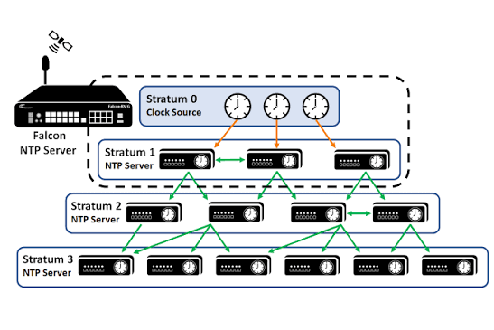

# NTP (Network Time Protocol)

- Cấu hình thời gian thủ công sẽ rất chậm và tốn công nếu phải cấu hình từng máy một
- **NTP** hỗ trợ đồng bộ thời gian cho toàn bộ thiết bị trong mạng thông qua các **NTP server**
- **NTP client** gửi yêu cầu thời gian (time) đến **NTP server** → sau đó đồng bộ theo thời gian nhận được từ server
- Một thiết bị có thể **vừa là NTP client, vừa là NTP server** cùng lúc (nhận giờ từ server cấp trên, đồng thời cấp giờ cho thiết bị cấp dưới)
- Độ chính xác:
  - Cùng LAN: sai lệch khoảng **~1 millisecond**
  - Khác mạng (qua Internet/WAN): độ trễ khoảng **~50 milliseconds** hoặc hơn
- Một số NTP server có độ chính xác **cao hơn** các server khác, tùy vào khoảng cách (số bước) đến nguồn giờ chuẩn gốc
- Khoảng cách từ một NTP server đến đồng hồ chuẩn gốc (reference clock) được gọi là **Stratum** — Stratum càng lớn thì độ trễ/sai số càng cao (càng xa nguồn chuẩn)
- NTP sử dụng **UDP port 123**

# Reference Clock

- Là thiết bị giữ thời gian **cực kỳ chính xác**, đóng vai trò là thời gian gốc cho toàn bộ hệ thống NTP
- Reference clock thuộc **Stratum 0** trong hệ thống NTP
- NTP server nào kết nối **trực tiếp** với Stratum 0 sẽ thuộc **Stratum 1**
- **Stratum 15** là mức tối đa được coi là còn tin cậy; nếu lớn hơn (Stratum 16) thì được xem là **không đáng tin cậy** và sẽ không được dùng để đồng bộ
- gói tin NTP có 8 bit nhưng chỉ dùng 4 bit (0 - 15) nên từ 16 trở đi sẽ không đáng tin cậy
- Các thiết bị **thuộc cùng một Stratum** vẫn có thể kết nối/đồng bộ chéo với nhau (peer)
- Một NTP client có thể đồng bộ cùng lúc với **nhiều NTP server** khác nhau để tăng độ tin cậy



## Cấu hình NTP client trên router
- Cấu hình để router đồng bộ với một NTP server cụ thể:
```
R1(config)# ntp server 216.234.35.0
```
- Chỉ cần khai báo địa chỉ IP của NTP server; router sẽ tự động lấy giờ và các thông tin đồng bộ cần thiết từ server đó, không cần khai báo thêm

## NTP public pool (pool.ntp.org) - không có trong topic CCNA

- `pool.ntp.org` là một cụm (pool) gồm hàng ngàn NTP server công cộng, miễn phí, do tình nguyện viên trên toàn thế giới đóng góp
- Khi khai báo `pool.ntp.org`, DNS sẽ **tự động phân giải** ra một hoặc vài server ngẫu nhiên gần vị trí của bạn nhất → giúp cân bằng tải (load balancing) giữa các server trong pool
- Có thể chỉ định theo khu vực để giảm độ trễ, ví dụ:

```
R1(config)# ntp server asia.pool.ntp.org
R1(config)# ntp server vn.pool.ntp.org
```

- Thường dùng cho **mạng nhỏ, lab, hoặc cá nhân** — không có hạ tầng NTP server nội bộ riêng
- Trong **mạng doanh nghiệp thực tế**, người ta thường không dùng trực tiếp `pool.ntp.org` cho từng thiết bị, mà:
  - Dựng 1-2 NTP server nội bộ (Stratum 2-3), các server này đồng bộ ra `pool.ntp.org` hoặc nguồn tin cậy khác
  - Toàn bộ router/switch/server nội bộ chỉ đồng bộ theo NTP server nội bộ đó
  - → giảm phụ thuộc Internet, tăng bảo mật, kiểm soát được nguồn giờ
- **Không nằm trong nội dung thi CCNA** (Cisco chỉ yêu cầu biết cú pháp `ntp server <ip>` chung, không yêu cầu biết `pool.ntp.org`) — đây là kiến thức thực tế nên biết thêm khi đi làm


## Kiểm tra trạng thái NTP
```
R1# show ntp associations
R1# show ntp status
```

## Lưu ý
- NTP luôn dùng **giờ UTC** để đảm bảo thời gian đồng bộ chính xác trên toàn hệ thống → còn **timezone** (múi giờ hiển thị) là cấu hình riêng trên từng thiết bị (bằng `clock timezone`), không ảnh hưởng đến việc đồng bộ NTP
- **Hardware clock**: chạy nhờ pin CMOS → không mất giờ khi tắt máy
  - Khi mất điện/reset, hardware clock vẫn tự lưu giờ và ngày, hoạt động độc lập với hệ điều hành
- **Software clock**: do hệ điều hành (IOS) quản lý
  - Khi hệ điều hành khởi động (boot), nó sẽ đọc thời gian từ hardware clock để khởi tạo giá trị ban đầu cho software clock
