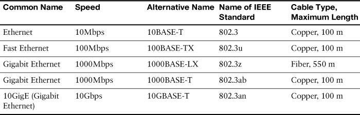
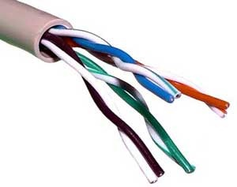

Ethernet Standard Copper

1. UTP (Unshielded Twisted Pair)

    

    This is a twin-strand cable - without shielding.
    Easy to install, inexpensive, and common in LANs.
    Examples: Cat5e, Cat6, Cat6a UTP.
    Advantages: Flexible, lightweight, and easy to bend.
    Disadvantages: Prone to interference in environments with many electromagnetic devices.

2. STP (Shielded Twisted Pair)

    

    It has shielding around each pair of wires or the entire cable.
    It reduces electromagnetic interference (EMI) better than UTP.
    It is commonly used in environments with many electrical devices and industrial machinery.
    Examples: Cat6a STP, Cat7 STP.
    Advantages: less interference, more stable over long distances.
    Disadvantages: stiff, difficult to bend, more expensive than UTP.

    10 Base-T and 100 Base-T -> use 2 pair (4 wire)
    + 1 2 3 6 are use (4 5 7 8 are not)
    + straight-through cable 
        * 1 2 -> send (TX)
        * 3 6 -> receive (RX)
    + crossover cable 
        * 1 2 -> receive (RX)
        * 3 6 -> send (TX) 
    1000 Base-T and 10 GBase-T -> 4 pair (8 wire) 
    + all 8 wire are use and can recive & send simultaneously (at the same time)
    + 100 Base-T: Full-duplex
    + 10 Gbase-T: full-duplex with encrypto high level