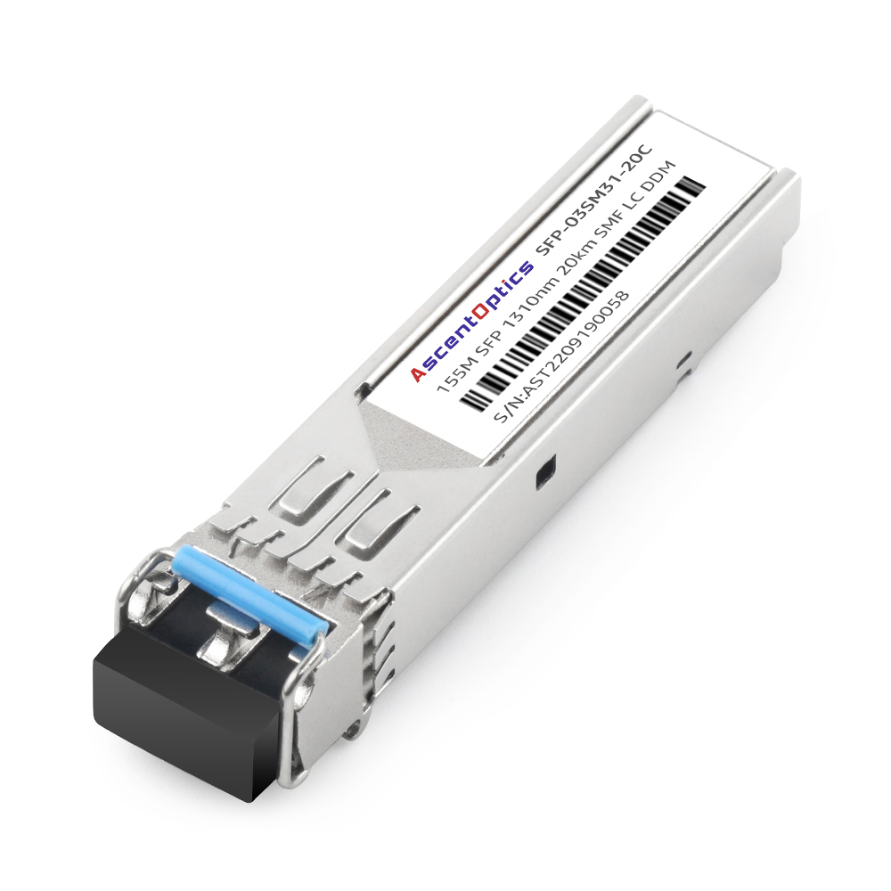
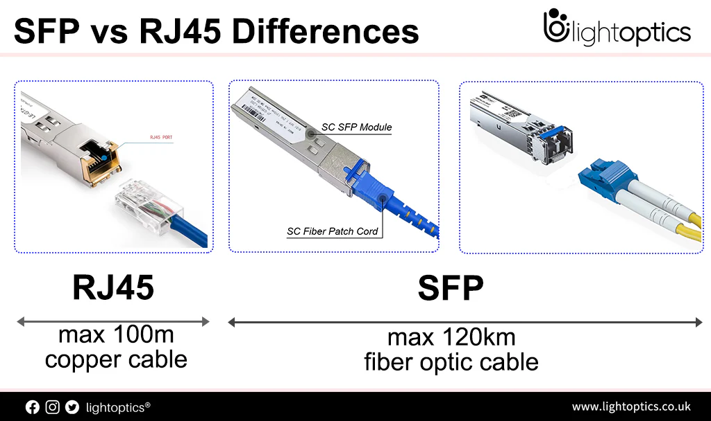

SFP (Small Form Factor) it's a small module that plugs into a network device (like a pull-out power strip).
It transforms the switch's ports into:
+ Fiber optic ports → connects via fiber optic cable, longer range, less interference
+ Copper ports → still uses RJ45 cable, but can support different speeds or offer flexible expansion

☢️ Key point: The two SFPs must be of the same type (optical ↔ optical, copper ↔ copper) and compatible in speed (1G, 10G, etc.).